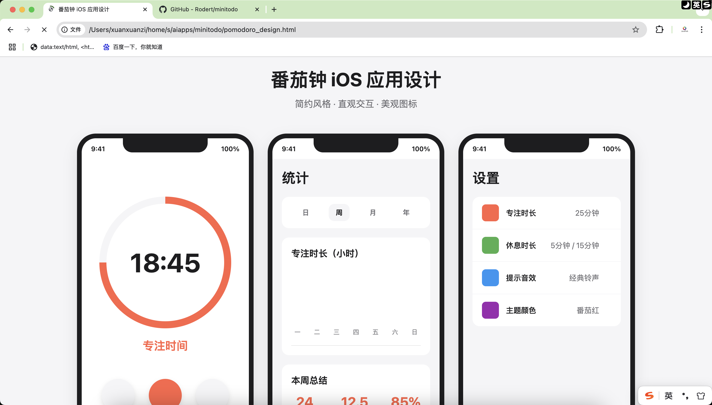

<<<<<<< HEAD
# minitodo
=======
<!--
 * @Author: JavaPub
 * @Date: 2025-03-19 10:39:08
 * @LastEditors: your name
 * @LastEditTime: 2025-03-19 11:06:22
 * @Description: Here is the JavaPub code base. Search JavaPub on the whole web.
 * @FilePath: /minitodo/README.md
-->
# 番茄钟微信小程序

一款简洁高效的番茄工作法时间管理小程序，帮助你提高工作和学习效率。

## 项目简介

番茄工作法（Pomodoro Technique）是一种时间管理方法，通过将工作分割成25分钟的专注工作时段，并在工作时段之间安排短暂休息来提高工作效率。本小程序基于这一理念，提供了一套完整的时间管理工具，帮助用户在日常工作和学习中更好地管理时间，提高效率。

## 功能特点

### 🕒 计时功能
- **多种模式**：支持"专注"、"短休息"和"长休息"三种计时模式
- **可视化计时**：圆形进度条直观展示剩余时间
- **灵活控制**：提供启动/暂停、重置和跳过按钮
- **自动切换**：时间结束后自动切换到下一个模式

### 📊 数据统计
- **多维度统计**：支持日、周、月、年四个时间维度的使用数据统计
- **图表可视化**：直观的图表展示使用情况
- **核心指标**：包括总专注次数、总专注小时数和完成率等关键数据
- **本地存储**：自动记录并保存所有番茄钟使用数据

### ⚙️ 个性化设置
- **时长设置**：可自定义专注时长（默认25分钟）、短休息时长（默认5分钟）和长休息时长（默认15分钟）
- **声音选择**：提供多种提示音效选项（经典铃声、数字铃声、自然铃声、无声）
- **主题定制**：多种主题色可选（番茄红、天空蓝、森林绿、紫罗兰）
- **数据管理**：支持清除历史记录等数据管理功能

## 使用说明

### 基本使用流程
1. 打开小程序，默认进入"专注"模式，时长为25分钟
2. 点击中间的播放按钮开始计时
3. 专注时间结束后，会自动切换到休息模式
4. 在统计页面查看您的番茄钟使用情况
5. 在设置页面自定义您的番茄钟参数

### 计时控制
- **▶️/⏸️ 按钮**：开始/暂停计时
- **🔄 按钮**：重置当前计时
- **⏭️ 按钮**：跳过当前计时，进入下一个模式

### 模式切换
点击底部的模式选择器可以手动切换不同的计时模式：
- **专注**：默认25分钟，用于集中精力工作或学习
- **短休息**：默认5分钟，用于短暂放松
- **长休息**：默认15分钟，通常在完成多个专注周期后使用

## 技术实现

本项目使用微信小程序原生开发，主要技术特点：
- 使用setInterval实现计时功能
- 采用CSS动画实现圆形进度条效果
- 全局状态管理保存用户设置
- 使用微信小程序Storage API实现本地数据存储
- 自定义数据统计和图表展示逻辑

## 未来计划

- [ ] 添加番茄钟记录和历史查询功能
- [ ] 实现用户登录和云端数据同步
- [ ] 增加待办事项管理功能
- [ ] 优化界面交互和动画效果
- [ ] 添加更多数据统计维度和图表类型

## 更新日志

### v1.3.0 (2023-07-20)
- 📊 实现番茄钟数据记录和统计功能
- 💾 添加本地数据存储和持久化
- 📈 多维度统计图表展示（日、周、月、年）
- 🧹 增加数据管理和清除功能
- 🔄 自动保存未完成的番茄钟记录
- 🎨 优化设置界面样式和交互

### v1.2.0 (2023-06-15)
- 🔍 根据设计图优化了底部导航栏
- 🌈 导航栏图标随当前模式变色
- 🧩 使用矢量图标替代导航栏表情符号
- 🎨 改进导航栏布局和交互体验

### v1.1.0 (2023-05-23)
- 🎨 根据设计图优化了计时器页面UI
- ✨ 改进模式选择器样式和交互体验
- 🌈 添加了不同模式的主题色切换效果
- 🔄 优化重置按钮旋转动画
- 🔧 使用矢量图标替代表情符号

### v1.0.0 (2023-03-16)
- 🚀 项目初始版本发布
- ✅ 实现基本的番茄钟计时功能
- ✅ 添加专注、短休息和长休息三种模式
- ✅ 实现可视化的圆形进度条
- ✅ 添加基础的使用数据统计
- ✅ 实现用户设置功能

## 关于作者

本项目由 [@YourName](https://github.com/YourName) 开发和维护。

## 许可证

[MIT License](LICENSE) 
>>>>>>> ddf76e6 (add)
